# ScholarMasterEngine - Alert Flow Mapping

**Purpose**: Visual and tabular reference for alert generation, routing, and escalation  
**Version**: 1.0  
**Last Updated**: January 27, 2026

---

## Alert System Architecture


---

## Alert Trigger Matrix

| Alert Type | Severity | Trigger Conditions | Detection Logic | Module |
|------------|----------|-------------------|-----------------|--------|
| **Security: Spoof Attempt** | 🔴 Critical | Liveness check failed | `is_live = False` from `LivenessDetector` | `master_engine.py` L234 |
| **Security: Unauthorized Presence** | 🔴 Critical | Unknown face detected (open-set rejection) | `found = False`, confidence < threshold | `master_engine.py` L245 |
| **Security: Crowd Mismatch** | 🔴 Critical | YOLO count > Face count + 2 | `crowd_count - face_count > 2` | `master_engine.py` L408 |
| **Warning: Truancy** | 🟡 Medium | Student in wrong location | `current_zone ≠ expected_room` | `master_engine.py` L261 |
| **Warning: Disturbance (Lecture)** | 🟡 Medium | Noise > 40 dB during lecture | `audio_db > 0.4 AND is_lecture_mode` | `master_engine.py` L504 |
| **Warning: Missing Student** | 🟡 Medium | Log count > Camera count | `log_count - crowd_count > 0` | `master_engine.py` L440 |
| **Warning: Sleeping Detected** | 🟡 Medium | Head-down posture > 30 frames | `sleep_counter > 30` | `master_engine.py` L376 |
| **Critical: Loud Noise/Scream** | 🔴 Critical | Audio > 80 dB (any mode) | `audio_db > 0.8` | `master_engine.py` L209 |
| **Critical: Violence Detected** | 🔴 Critical | Proximity violation + aggression | `is_violence = True` from `SafetyEngine` | `master_engine.py` L291 |
| **Grooming: Uniform Violation** | 🟠 Low | Non-uniform clothing detected | `is_uniform_ok = False` from `GroomingInspector` | `master_engine.py` L326 |

---

## Alert Payload Structure

### Standard Alert Format

```json
{
  "timestamp": "2026-01-27T10:30:15.342Z",
  "type": "Warning" | "Critical" | "Security" | "Grooming",
  "msg": "Human-readable description",
  "zone": "Physical location (e.g., 'Lab-1', 'Main Entrance')"
}
```

### Extended Payload Examples

#### Security Alert (Spoof)
```json
{
  "timestamp": "2026-01-27T09:15:23.123Z",
  "type": "Security",
  "msg": "Spoof Attempt Detected - Photo/Video attack",
  "zone": "Main Entrance",
  "detection_method": "Liveness Check Failed",
  "confidence_score": 0.12
}
```

#### Warning Alert (Truancy)
```json
{
  "timestamp": "2026-01-27T10:00:45.789Z",
  "type": "Warning",
  "msg": "Truancy: S101 detected in Main Entrance. Expected in Lab-1 for Data Structures",
  "zone": "Main Entrance",
  "student_id": "S101",
  "expected_location": "Lab-1",
  "expected_subject": "Data Structures",
  "teacher": "Ms. Davis"
}
```

#### Critical Alert (Violence)
```json
{
  "timestamp": "2026-01-27T14:22:10.456Z",
  "type": "Critical",
  "msg": "Violence Detected: Proximity Violation AND Aggressive Posture",
  "zone": "Cafeteria",
  "person_indices": [3, 7],
  "inter_person_distance_px": 35,
  "threat_level": "HIGH"
}
```

---

## Recipient Routing Logic

### By Alert Type

| Alert Type | Primary Recipients | Secondary Recipients (Escalation) | Timing |
|------------|-------------------|-----------------------------------|--------|
| **Security** | • Security Team<br>• Admin | • HOD (if student-related) | Immediate |
| **Warning** | • Class Teacher<br>• HOD (dept) | • Admin (if sustained >2min) | After 30s |
| **Critical** | • Security<br>• HOD<br>• Admin | • Emergency Services (if violence) | Immediate |
| **Grooming** | • Class Teacher | • HOD (if repeated) | Next day batch |

### Role-Based Delivery

```python
# Pseudo-code for recipient determination
def determine_recipients(alert):
    recipients = []
    
    if alert["type"] == "Security":
        recipients.append("security@institution.edu")
        recipients.append("admin@institution.edu")
        
    elif alert["type"] == "Warning":
        # Get class teacher from timetable
        teacher = get_teacher_from_timetable(alert["zone"], alert["timestamp"])
        recipients.append(teacher["email"])
        
        # Get HOD from department
        dept = get_department_from_zone(alert["zone"])
        hod = get_hod(dept)
        recipients.append(hod["email"])
        
    elif alert["type"] == "Critical":
        recipients.append("security@institution.edu")
        recipients.append("admin@institution.edu")
        
        dept = get_department_from_zone(alert["zone"])
        hod = get_hod(dept)
        recipients.append(hod["email"])
        
    elif alert["type"] == "Grooming":
        teacher = get_class_teacher_from_student(alert["student_id"])
        recipients.append(teacher["email"])
        
    return recipients
```

---

## Escalation Tiers

### Tier 1: Immediate (0-30s)

**Triggered For**: Security, Critical alerts

**Actions**:
- Push notification to Security mobile app
- Email to security@institution.edu
- SMS to on-duty security personnel
- Admin Panel Alert Center update (real-time)

**Example**:
```
ALERT: Violence Detected - Cafeteria
Time: 2026-01-27 14:22:10
Action Required: Immediate dispatch
```

### Tier 2: Escalated (30s-2min)

**Triggered For**: Warning alerts (sustained)

**Actions**:
- Notification to Class Teacher
- Email to HOD
- Admin Panel dashboard flag

**Example**:
```
ALERT: Disturbance detected in Lab-1 for 45 seconds
Class: Data Structures (Ms. Davis)
Action: Review and investigate
```

### Tier 3: Batch/Review (Next Day)

**Triggered For**: Grooming alerts

**Actions**:
- Daily digest email to Class Teachers
- Summarized report to HOD
- Admin review queue

**Example**:
```
Daily Grooming Report - 2026-01-27
- 3 uniform violations (Section A)
- 1 ID badge missing (Section B)
Action: Counsel students
```

---

## Admin Panel Integration

### Alert Center Tab

**File**: [`admin_panel.py`](file:///Users/premkumartatapudi/Desktop/ScholarMasterEngine/admin_panel.py#L582-L645)

**UI Components**:

1. **Alert List** (Scrollable)
   - Color-coded by severity:
     - 🔴 Red: Security, Critical
     - 🟡 Yellow: Warning
     - 🟠 Orange: Grooming
   - Sorted: Most recent first
   - Auto-refresh: Every 5 seconds (via Streamlit rerun)

2. **Alert Details Panel**
   - Timestamp
   - Zone (with camera preview link)
   - Message
   - Metadata (student ID, faculty, subject)

3. **Action Buttons**
   - **✅ Confirm**: Mark as valid incident
     - Logs to `data/incident_log.csv`
     - Removes from active alerts queue
   - **❌ Dismiss**: Mark as false positive
     - Logs to `data/dismissed_alerts.csv`
     - Removes from queue
   - **🔇 Snooze**: Temporarily hide (15 min)
     - Remains in queue but hidden

### RBAC for Alert Center

| Role | Alert Visibility | Actions Allowed |
|------|------------------|-----------------|
| **Super Admin** | All alerts (institution-wide) | Confirm, Dismiss, Snooze, Delete |
| **Faculty Manager** | Department-scoped alerts | Confirm, Dismiss, Snooze |
| **Faculty** | Own class alerts only | View only |
| **Security** | Security + Critical alerts | Confirm, Dismiss |
| **Student** | No access | N/A |

---

## Alert Persistence & Retention

### Data Files

#### `data/alerts.json` (Active Queue)

**Purpose**: Real-time alert queue  
**Retention**: Last 100 alerts (rolling)  
**Format**: JSON Array

```json
[
  {
    "timestamp": "2026-01-27T10:30:15.342Z",
    "type": "Warning",
    "msg": "Truancy: S101...",
    "zone": "Main Entrance"
  },
  ...
]
```

**Cleanup**: Automatically trimmed in `trigger_alert()` method

#### `data/incident_log.csv` (Confirmed Incidents)

**Purpose**: Historical record of confirmed incidents  
**Retention**: Permanent (or per policy)  
**Format**: CSV

```csv
timestamp,type,message,zone,action_by,resolution
2026-01-27T14:22:10,Critical,Violence Detected,Cafeteria,security_guard_01,Resolved - Students separated
```

#### `data/dismissed_alerts.csv` (False Positives)

**Purpose**: ML training data for false positive reduction  
**Retention**: 90 days  
**Format**: CSV

```csv
timestamp,type,message,zone,dismissed_by,reason
2026-01-27T10:35:00,Warning,Disturbance,Lab-1,admin,Mic malfunction
```

---

## Notification Channels

### Current Implementation (Simulation)

**File**: [`notification_service.py`](file:///Users/premkumartatapudi/Desktop/ScholarMasterEngine/modules_legacy/notification_service.py)

**Method**: `_dispatch(alert)`

**Current Action**: Console print (structured logging)

```python
def _dispatch(self, alert):
    print(f"\n{'='*60}")
    print(f"🔔 DISPATCHING ALERT [{alert['type'].upper()}]")
    print(f"{'='*60}")
    print(f"⏰ Time: {alert['timestamp']}")
    print(f"📍 Zone: {alert['zone']}")
    print(f"💬 Message: {alert['msg']}")
    print(f"{'='*60}\n")
```

### Production Integration (Recommended)

#### Email (SendGrid/SMTP)

```python
import sendgrid
from sendgrid.helpers.mail import Mail

def _dispatch_email(alert, recipients):
    message = Mail(
        from_email='alerts@institution.edu',
        to_emails=recipients,
        subject=f"[{alert['type']}] Alert - {alert['zone']}",
        html_content=f"<p>{alert['msg']}</p>"
    )
    
    sg = sendgrid.SendGridAPIClient(api_key=os.environ.get('SENDGRID_API_KEY'))
    response = sg.send(message)
```

#### SMS (Twilio)

```python
from twilio.rest import Client

def _dispatch_sms(alert, phone_numbers):
    client = Client(account_sid, auth_token)
    
    for phone in phone_numbers:
        message = client.messages.create(
            body=f"[{alert['type']}] {alert['msg']} at {alert['zone']}",
            from_='+1234567890',
            to=phone
        )
```

#### Push Notification (Firebase Cloud Messaging)

```python
import firebase_admin
from firebase_admin import messaging

def _dispatch_push(alert, device_tokens):
    message = messaging.MulticastMessage(
        notification=messaging.Notification(
            title=f"{alert['type']} Alert",
            body=alert['msg']
        ),
        tokens=device_tokens
    )
    
    response = messaging.send_multicast(message)
```

---

## Performance Characteristics

**Polling Frequency**: 2 seconds (configurable in `NotificationDispatcher`)  
**Alert Generation Latency**: <5ms (atomic file write)  
**Dispatch Latency**: 0-2 seconds (polling interval)  
**Maximum Alert Queue Size**: 100 alerts

**Bottleneck**: File I/O for `alerts.json` (negligible at institutional scale)

**Scalability**: For >10k alerts/day, migrate to Redis queue or database

---

## Alert Flow Diagram (Detailed)

```mermaid
sequenceDiagram
    participant E as Event Detection<br/>(Video/Audio Thread)
    participant M as ScholarMasterEngine
    participant A as alerts.json
    participant D as NotificationDispatcher
    participant P as Admin Panel<br/>Alert Center
    participant R as Recipients<br/>(Email/SMS)
    
    E->>M: Detect violation<br/>(Truancy/Violence/Noise)
    M->>M: trigger_alert(type, msg, zone)
    M->>A: Atomic write<br/>(temp → replace)
    
    Note over D: Polling every 2s
    D->>A: Read alerts.json
    D->>D: Filter new alerts<br/>(timestamp > last_checked)
    
    alt New alerts found
        D->>R: Dispatch<br/>(Email/SMS/Push)
        D->>D: Update last_checked_timestamp
    end
    
    Note over P: User opens Alert Center
    P->>A: Load alerts.json
    P->>P: Display in UI<br/>(color-coded)
    
    alt User clicks Confirm
        P->>P: Log to incident_log.csv
        P->>A: Remove from alerts.json
    else User clicks Dismiss
        P->>P: Log to dismissed_alerts.csv
        P->>A: Remove from alerts.json
    end
```



---

## Testing Alert Flows

### Manual Test: Generate Test Alert

```python
# In Python REPL or test script
from modules_legacy.master_engine import ScholarMasterEngine

engine = ScholarMasterEngine(...)
engine.trigger_alert(
    alert_type="Warning",
    message="TEST ALERT: System verification",
    location="Test Zone"
)

# Verify: data/alerts.json should contain new entry
```

### Automated Test: Alert Dispatch

```bash
# Run notification service
python -c "
from modules_legacy.notification_service import NotificationDispatcher
import time

dispatcher = NotificationDispatcher()
dispatcher.start()
time.sleep(10)  # Watch console for dispatches
dispatcher.stop()
"
```

### Integration Test: End-to-End

```bash
# 1. Start main system
python main_unified.py &

# 2. Trigger event (e.g., play loud audio for noise alert)

# 3. Check alerts.json
cat data/alerts.json | python -m json.tool

# 4. Open Admin Panel
streamlit run admin_panel.py

# 5. Verify alert appears in Alert Center tab
```

---

## Future Enhancements

### Real-Time Dashboard (WebSocket)

Replace polling with push-based architecture:

```python
# WebSocket server in main_unified.py
import asyncio
import websockets

async def alert_broadcaster(websocket, path):
    while True:
        # On new alert generation
        await websocket.send(json.dumps(alert))
```

### Machine Learning Alert Filtering

Reduce false positives using ML:

```python
# Train classifier on dismissed_alerts.csv
from sklearn.ensemble import RandomForestClassifier

features = [
    'audio_db',
    'time_of_day',
    'zone_type',
    'student_count'
]

model = RandomForestClassifier()
model.fit(X_train, y_train)  # y = is_false_positive

# In trigger_alert():
if model.predict(alert_features) == 1:  # Likely false positive
    confidence_score = model.predict_proba(alert_features)[0][1]
    if confidence_score > 0.8:
        return  # Suppress alert
```

---

**Related Documentation**:
- [INSTITUTIONAL_BEHAVIORS.md](file:///Users/premkumartatapudi/Desktop/ScholarMasterEngine/docs/INSTITUTIONAL_BEHAVIORS.md) - Alert types & triggers
- [END_TO_END_SCENARIOS.md](file:///Users/premkumartatapudi/Desktop/ScholarMasterEngine/docs/END_TO_END_SCENARIOS.md) - Alert scenarios

**Document Version**: 1.0  
**Maintainer**: Narendra P (@NarendraaP)  
**Last Review**: January 27, 2026
