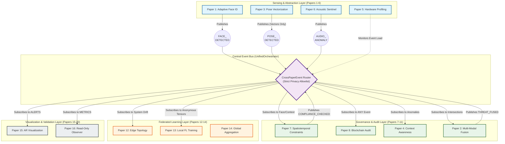

# ScholarMasterEngine: Unified Integration Architecture (20 Papers)

This document visualizes the cohesive, event-driven architecture that unifies the 20 distinct research papers of the ScholarMaster series into a single, conflict-free "System of Systems."

## The "Dependency Inversion" Integration Strategy

The core of the ScholarMaster integration strategy relies on **Dependency Inversion** and the **UnifiedOrchestrator** acting as a central Event Bus. 

Instead of Paper 2 (Fusion) explicitly depending on the code of Paper 3 (Pose), both papers depend on a shared abstraction: the `CrossPaperEvent`. 
- **Upstream (Sensing):** Papers 1-6 act as isolated producers. They process raw physical data (video, audio) and publish anonymous, validated events to the bus. They immediately securely delete the raw data.
- **The Orchestrator:** Validates the payload against strict privacy allowlists before routing.
- **Downstream (Governance, Learning, UI):** Papers 7-20 act as consumers. They subscribe to specific event types, completely agnostic to how the events were generated.

This architecture ensures that implementing a new paper (e.g., adding Federated Learning in Paper 12) requires zero modifications to the core sensing logic, preventing architectural degradation.

## Unified Architecture Diagram

## How This Prevents Conflict

When Paper 7 (Spatiotemporal Constraints) is implemented, it does not query the camera or microphone. It subscribes to the `UnifiedOrchestrator` to receive `FACE_DETECTED` events. 

If Paper 3 (Pose Privacy) ensures that RGB frames are instantly destroyed, Paper 7's implementation is entirely unaffected as it already operates solely on the abstract, delayed, and privacy-filtered events provided by the Orchestrator. No implementation degrades another, and Papers 16-20 act entirely as read-only observers on the event stream, ensuring zero interference with production logic.
