# ScholarMaster Canonical P1–P25 Master Publication Roadmap

**Governance Framework**: `SROS Version 2.1 — RATIFIED` | `SEOP Version 2.0 — RATIFIED` | `SROS-004 Single-Owner Law`  
**Master Plan Source**: [`docs/governance/21_PAPER_ECOSYSTEM_MASTER_PLAN.md`](file:///Users/premkumartatapudi/Desktop/ScholarMasterEngine/docs/governance/21_PAPER_ECOSYSTEM_MASTER_PLAN.md) & [`docs/21_paper_portfolio_master_registry/21_PAPER_PORTFOLIO_MASTER_REGISTRY.md`](file:///Users/premkumartatapudi/Desktop/ScholarMasterEngine/docs/21_paper_portfolio_master_registry/21_PAPER_PORTFOLIO_MASTER_REGISTRY.md)  
**Governance Archive**: `research_governance/master_publication_roadmap/`  
**Status**: 🏆 **CANONICAL P1–P25 MASTER ROADMAP RATIFIED**  

---

## 1. Master Publication Roadmap Table (P1–P25)

| Order | Paper | Scientific Role | Publication Role | Target Venue | Venue Type | Dependency | Planned Submission Window | Current Status | Venue Verified? |
|:---:|:---:|---|---|---|:---:|---|:---:|:---:|:---:|
| **1** | **P22** | Perception Integrity & Evidential Uncertainty | Foundational Perception & Trustworthy ML | IEEE TPAMI / IEEE Sensors Journal | Journal | None (Root sensory foundation) | Q1 2027 (Month 1) | `CLASS_A_READY` | 🟢 YES |
| **2** | **P5** | Edge Multi-Thread Synchronization & Scaling | Hardware Efficiency Modeling | IEEE Access | Journal | None (Local hardware framing) | Q1 2027 (Month 1) | `CLASS_A_READY` | 🟢 YES |
| **3** | **P6** | Non-Semantic Acoustic Sentinel & FFT Extraction | Acoustic Sensing Subsystem | IEEE Sensors Journal / ACM TECS | Journal | None (Acoustic spectral features only) | Q1 2027 (Month 1) | `CLASS_A_READY` | 🟢 YES |
| **4** | **P3** | Zero-Persistence RAM Destruction Boundary | Vision Geometry & Memory Privacy | IEEE IoT Journal | Journal | P22 (ValidatedFeaturePayload interface) | Q1 2027 (Month 2) | `CLASS_B_SYNCHRONIZED` | 🟢 YES |
| **5** | **P7** | Sub-Millisecond Vector Retrieval at Scale | Identity Retrieval & Indexing Subsystem | Computers & Security | Journal | P22 (Validated query-input contract) | Q1 2027 (Month 2) | `CLASS_B_SYNCHRONIZED` | 🟢 YES |
| **6** | **P23** | Adaptive Trustworthy Edge Systems & SLA Bounds | Real-Time Systems & Dynamic Cascades | IEEE RTSS / IEEE Trans. Computers | Conf / Jour | P22 (Evidential risk metrics for 4-state dispatch) | Q2 2027 (Month 4) | `CLASS_A_READY` | 🟢 YES |
| **7** | **P2** | Multi-Tier Hierarchical Federated Averaging | Probabilistic Interpretation & Vector Fusion | IEEE Trans. Cybernetics / IEEE T-FL | Journal | P22 (Perception validity qualification) | Q2 2027 (Month 4) | `CLASS_B_SYNCHRONIZED` | 🟢 YES |
| **8** | **P4** | Spatiotemporal Compliance Solver (ST-CSF) | Logical Evaluation & Compliance Layer | ACM TAAS / JSA | Journal | P22 (Validated event-stream qualification) | Q2 2027 (Month 5) | `CLASS_B_SYNCHRONIZED` | 🟢 YES |
| **9** | **P9** | Kinematic Transit Velocity Filtering & Memory | Control Dispatch & Non-Bypassable Gate | ACM Trans. Autonomous & Adaptive Systems | Journal | P4 (Spatio-temporal compliance state) | Q2 2027 (Month 5) | `CLASS_A_READY` | 🟢 YES |
| **10** | **P24** | Generalized Cross-Modal Recovery under Degradation | Multimodal Sensor Fusion & Info Geometry | IEEE TMM / IEEE TSP / Information Fusion | Journal | P22, P6, P3 (Multimodal sensory streams) | Q3 2027 (Month 7) | `CLASS_A_READY` | 🟢 YES |
| **11** | **P11** | Automated Cold-Boot Edge Recovery Engine | Stateful Execution & Container Recovery | ACM/IFIP/USENIX Middleware | Conf | P9, P5 (Container lifecycle & power) | Q3 2027 (Month 7) | `CLASS_A_READY` | 🟢 YES |
| **12** | **P12** | Local-First Differential Privacy / Fed Comm | Distributed Infrastructure & Network Privacy | IEEE TNSM / IEEE Trans. Communications | Journal | P2 (Federated aggregation baseline) | Q3 2027 (Month 8) | `CLASS_A_READY` | 🟢 YES |
| **13** | **P20** | Non-Linear Power Modeling on ARM Edge SoCs | Runtime Scheduling & Dynamic Scaling | IEEE TPDS | Journal | P5 (Thermal power scaling) | Q3 2027 (Month 8) | `CLASS_A_READY` | 🟢 YES |
| **14** | **P8** | Tamper-Evident SHA-256 Merkle Audit Ledger | Privacy Governance & Cryptographic Ledger | IEEE TDSC | Journal | P4 (Decision event commit) | Q4 2027 (Month 10) | `CLASS_A_READY` | 🟢 YES |
| **15** | **P16** | Distributed Consensus & Institutional Trust | Trust & Longitudinal Field Evaluation | AI & Society | Journal | P8 (Audit trail verification) | Q4 2027 (Month 10) | `CLASS_A_READY` | 🟢 YES |
| **16** | **P19** | Physical Threat Perimeter & Adversarial Defense | Threat Modeling & TCB Demarcation | Journal of Computer Security / ESORICS | Jour / Conf | P22 (Layer-1 perception filter boundary) | Q4 2027 (Month 11) | `CLASS_B_SYNCHRONIZED` | 🟢 YES |
| **17** | **P13** | Acoustic Energy Thresholding in Ambiguous Visuals | Drift Modeling & Adaptation | Adaptive Behavior | Journal | P6 (Acoustic sentinel foundation) | Q1 2028 (Month 13) | `CLASS_A_READY` | 🟢 YES |
| **18** | **P14** | Multi-Rate Bayesian Kinematic Filter & Simulation | Federated Scaling & Kinematics | IEEE IoT-J / ACM TiiS | Journal | P9 (Kinematic transit bounds) | Q1 2028 (Month 13) | `CLASS_A_READY` | 🟢 YES |
| **19** | **P10** | Hardware Watchdog & Failure Containment | Decoupled Stack Software Validation | IEEE Internet of Things Journal | Journal | P22 (External perception fault class qualification) | Q1 2028 (Month 14) | `CLASS_B_SYNCHRONIZED` | 🟢 YES |
| **20** | **P15** | Formal Verification of Access / Situational UI | Interface & Human Interaction Layer | ACM CHI / Formal Methods | Conf | P4 (Schedule access states) | Q1 2028 (Month 14) | `CLASS_A_READY` | 🟢 YES |
| **21** | **P17** | Adaptive Quantization for Embeddings / Ethics | Governance Philosophy & Ethics Doctrine | AI & Society | Journal | P7 (Embedding quantization foundations) | Q2 2028 (Month 16) | `CLASS_A_READY` | 🟢 YES |
| **22** | **P18** | Edge Runtime Supervisor & Circuit Breaker | Reference Architecture Contracts & Chaos | IEEE Systems Journal | Journal | P22 (Perception quarantine linked to supervisor) | Q2 2028 (Month 16) | `CLASS_B_SYNCHRONIZED` | 🟢 YES |
| **23** | **P25** | Macro Integration Architecture & Error Propagation | Macro Systems Safety & Containment Proofs | IEEE TDSC / ACM TOSEM | Journal | P22, P23, P24, P4, P8 (Complete 5-layer pipeline) | Q3 2028 (Month 18) | `CLASS_A_READY` | 🟢 YES |
| **24** | **P21** | Formal Mathematical Foundations of Compliance | Formal Foundations & Timed Automata | Formal Aspects Comput. / CAV / CPS-Com | Jour / Conf | P4, P9 (Formal automata logic) | Q3 2028 (Month 18) | `CLASS_A_READY` | 🟢 YES |
| **25** | **P1** | ScholarMaster Macro System Architecture | ScholarMaster Ecosystem Synthesis (Capstone) | IEEE Systems Journal | Journal | P2-P25 (Retrospective unification of all accepted DOIs) | Q4 2028 (Month 20) | `CLASS_B_SYNCHRONIZED` | 🟢 YES |

---

## 2. Seven-Stage Publication Dependency Graph

```mermaid
graph TD
    classDef phase1 fill:#e3f2fd,stroke:#1565c0,stroke-width:2px;
    classDef phase2 fill:#e8f5e9,stroke:#2e7d32,stroke-width:2px;
    classDef phase3 fill:#fff3e0,stroke:#e65100,stroke-width:2px;
    classDef phase4 fill:#f3e5f5,stroke:#7b1fa2,stroke-width:2px;
    classDef phase5 fill:#ede7f6,stroke:#4527a0,stroke-width:2px;
    classDef phase6 fill:#fbe9e7,stroke:#d84315,stroke-width:2px;
    classDef phase7 fill:#e0f2f1,stroke:#00695c,stroke-width:2px;

    subgraph Phase1["Phase 1: Subsystem Sensing & Perception Integrity"]
        P22["P22: Perception Integrity (TPAMI/Sensors)"]:::phase1
        P5["P5: Thermal Power Scaling (IEEE Access)"]:::phase1
        P6["P6: Acoustic Sentinel (Sensors/TECS)"]:::phase1
        P3["P3: Zero-Persistence RAM (IEEE IoT-J)"]:::phase1
        P7["P7: Vector Retrieval at Scale (Comp & Sec)"]:::phase1
    end

    subgraph Phase2["Phase 2: Dynamic Cascades & Reasoning"]
        P23["P23: Adaptive Edge Cascades (RTSS/TC)"]:::phase2
        P2["P2: Hierarchical H-FedAvg (IEEE T-Cyb)"]:::phase2
        P4["P4: ST-CSF Compliance (ACM TAAS)"]:::phase2
        P9["P9: Control Dispatch & Velocity (ACM TAAS)"]:::phase2
    end

    subgraph Phase3["Phase 3: Cross-Modal Consensus & Scheduling"]
        P24["P24: Cross-Modal Recovery (TMM/TSP)"]:::phase3
        P11["P11: Cold-Boot Recovery (Middleware)"]:::phase3
        P12["P12: Differential Privacy (TNSM/T-Comm)"]:::phase3
        P20["P20: Power Modeling & Scheduling (TPDS)"]:::phase3
    end

    subgraph Phase4["Phase 4: Cryptographic Trust & Threat Perimeter"]
        P8["P8: SHA-256 Merkle Ledger (TDSC)"]:::phase4
        P16["P16: Distributed Consensus (AI & Soc)"]:::phase4
        P19["P19: Threat Perimeter & TCB (JCS/ESORICS)"]:::phase4
    end

    subgraph Phase5["Phase 5: Adaptation, Kinematics & Validation"]
        P13["P13: Acoustic Energy Drift (Adapt Behav)"]:::phase5
        P14["P14: Bayesian Kinematic Filter (IoT-J/TiiS)"]:::phase5
        P10["P10: Hardware Watchdog (IEEE IoT-J)"]:::phase5
        P15["P15: Access Verification & UI (CHI/FM)"]:::phase5
    end

    subgraph Phase6["Phase 6: Ethics & Reference Architecture"]
        P17["P17: Quantization & Ethics (AI & Soc)"]:::phase6
        P18["P18: Runtime Supervisor (IEEE Systems)"]:::phase6
    end

    subgraph Phase7["Phase 7: Formal Foundations & Macro Synthesis"]
        P25["P25: Macro Error Propagation (TDSC/TOSEM)"]:::phase7
        P21["P21: Formal Foundations (FAC/CAV)"]:::phase7
        P1["P1: ScholarMaster Capstone (IEEE Systems)"]:::phase7
    end

    P22 --> P23
    P22 --> P24
    P22 --> P3
    P22 --> P7
    P22 --> P2
    P22 --> P4
    P4 --> P9
    P4 --> P8
    P4 --> P15
    P4 --> P21
    P6 --> P24
    P6 --> P13
    P3 --> P24
    P8 --> P16
    P9 --> P11
    P9 --> P14
    P5 --> P20
    P2 --> P12
    P22 --> P25
    P23 --> P25
    P24 --> P25
    P8 --> P25
    P25 --> P1
    P21 --> P1
    P18 --> P1
```

---

## 3. Special Strategic Positioning of P22–P25

1. **P22 (Phase 1, Order 1)**: Placed as the foundational root sensory gatekeeper. It must precede downstream cascade routing and cross-modal recovery to establish the evidential uncertainty ground truth.
2. **P23 (Phase 2, Order 6)**: Placed immediately after P22 in Phase 2 to introduce real-time multi-stage dynamic routing and sub-5.0 ms SLA bounds on edge hardware.
3. **P24 (Phase 3, Order 10)**: Placed in Phase 3 after single-modality foundations (P22 visual, P6 acoustic, P3 pose) are established, demonstrating $100\%$ recovery under sensory degradation.
4. **P25 (Phase 7, Order 23)**: Placed in Phase 7 as the penultimate macro systems safety proof (Voronoi step jump discontinuity and end-to-end EAF containment), directly preceding the P1 capstone synthesis.
