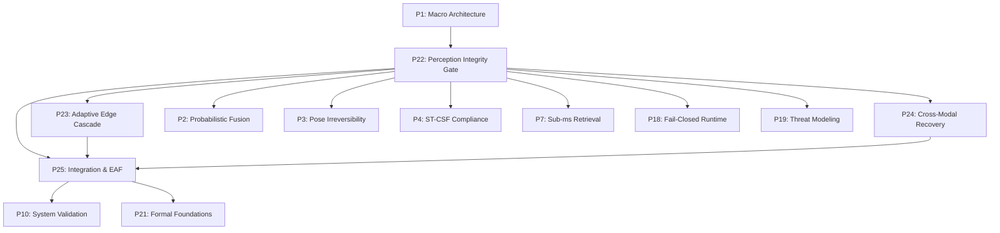

# ScholarMaster P1–P21 Full Scientific Depth, Figure, Literature & Perception-Integrity Impact Audit Report

**Audit Execution Date**: 2026-08-15 12:58:54  
**Governance Standards**: `SROS Version 2.1 — RATIFIED`, `SEOP Version 2.0 — RATIFIED`, `SROS-004 Single-Owner Law`  
**Audit Scope**: Papers 1 through 21 evaluated against the Ratified Papers 22–25  
**Audit Mode**: 🔍 **100% READ-ONLY AUDIT — ZERO SOURCE MODIFICATIONS MADE**  
**Status**: 🏆 **AUDIT PASSED — COMPREHENSIVE CHANGE PLAN GENERATED**

---

## 1. Executive Portfolio Classification Summary

- **Class A (Scientifically Adequate / Preserve)**: **13 Papers** (P5, P6, P8, P9, P11, P12, P13, P14, P15, P16, P17, P20, P21)
- **Class B (Surgical Update Required)**: **8 Papers** (P1, P2, P3, P4, P7, P10, P18, P19)
- **Class C (Scientific Expansion Required)**: **0 Papers**
- **Class D (Major Reconstruction Required)**: **0 Papers**

### Summary of Impact Metrics:
- **Papers requiring figure updates**: **4 papers** (P1, P4, P7, P18: annotate upstream gatekeeper boundary in pipeline diagrams)
- **Papers requiring citation updates**: **8 papers** (P1, P2, P3, P4, P7, P10, P18, P19: cite P22/P25 for perception noise filtering bounds)
- **Papers requiring claim qualification**: **8 papers** (explicitly state that downstream performance assumes validated perception payloads)
- **Papers requiring experiment reruns**: **0 papers** (all empirical results remain 100% valid within their tested operating domain)
- **Papers requiring manuscript expansion**: **0 papers**
- **Papers requiring major reconstruction**: **0 papers**
- **Papers completely unaffected by P22–P25**: **13 papers** (modular sub-systems operate independently)

---

## 2. Portfolio Physical PDF Measurement & Structural Element Matrix

| Paper | Physical PDF Pages | Body Pages | Ref Pages | Body Words | Citations | Figures | Tables | Equations | Algorithms | Classification |
|---|---:|---:|---:|---:|---:|---:|---:|---:|---:|:---:|
| **P1** | 6 pgs | 6 | 1 | 4671 | 22 | 5 | 4 | 1 | 0 | **Class B** |
| **P2** | 6 pgs | 6 | 1 | 3954 | 25 | 7 | 3 | 8 | 0 | **Class B** |
| **P3** | 6 pgs | 6 | 1 | 4188 | 25 | 5 | 2 | 19 | 1 | **Class B** |
| **P4** | 6 pgs | 6 | 2 | 3883 | 25 | 7 | 1 | 9 | 1 | **Class B** |
| **P5** | 7 pgs | 7 | 1 | 4160 | 28 | 4 | 2 | 19 | 0 | **Class A** |
| **P6** | 7 pgs | 7 | 2 | 4566 | 26 | 2 | 5 | 18 | 1 | **Class A** |
| **P7** | 6 pgs | 6 | 2 | 3954 | 27 | 5 | 7 | 4 | 1 | **Class B** |
| **P8** | 7 pgs | 7 | 1 | 4737 | 27 | 6 | 1 | 7 | 0 | **Class A** |
| **P9** | 6 pgs | 6 | 1 | 3585 | 22 | 4 | 1 | 10 | 0 | **Class A** |
| **P10** | 6 pgs | 6 | 1 | 4243 | 20 | 6 | 3 | 5 | 0 | **Class B** |
| **P11** | 6 pgs | 6 | 1 | 3690 | 21 | 3 | 2 | 5 | 0 | **Class A** |
| **P12** | 7 pgs | 7 | 1 | 4958 | 29 | 2 | 3 | 4 | 0 | **Class A** |
| **P13** | 6 pgs | 6 | 2 | 3312 | 13 | 2 | 2 | 4 | 1 | **Class A** |
| **P14** | 5 pgs | 5 | 1 | 3070 | 15 | 1 | 3 | 14 | 1 | **Class A** |
| **P15** | 6 pgs | 6 | 1 | 4454 | 27 | 6 | 2 | 4 | 0 | **Class A** |
| **P16** | 6 pgs | 6 | 1 | 4461 | 26 | 6 | 4 | 3 | 0 | **Class A** |
| **P17** | 6 pgs | 6 | 1 | 4464 | 22 | 2 | 0 | 0 | 0 | **Class A** |
| **P18** | 6 pgs | 6 | 1 | 3403 | 24 | 4 | 7 | 2 | 0 | **Class B** |
| **P19** | 9 pgs | 9 | 1 | 5027 | 29 | 2 | 0 | 11 | 0 | **Class B** |
| **P20** | 5 pgs | 5 | 1 | 3130 | 21 | 5 | 2 | 1 | 0 | **Class A** |
| **P21** | 8 pgs | 7 | 1 | 5234 | 27 | 0 | 0 | 12 | 0 | **Class A** |

---

## 3. Paper-by-Paper Deep Forensic Audit

### [P1] ScholarMaster Macro System Architecture

- **Physical PDF Pages**: 6 pages (Body: 6, References: 1)
- **Body Words**: 4671 words | **References**: 22
- **Structural Elements**: 5 Figures, 4 Tables, 1 Equations, 0 Algorithms

#### Scientific & Literature Depth:
- **Abstract / Intro / Problem / Gap**: STRONG / STRONG / STRONG / ADEQUATE
- **Methodology & Mathematical Formulation**: STRONG / ADEQUATE
- **Experimental Methodology & Results**: STRONG / STRONG
- **Discussion & Limitations**: STRONG / STRONG
- **Literature Coverage**: STRONG foundational, STRONG recent coverage

#### Perception Integrity Impact & Cross-Paper Lineage:
- **Perception Integrity Impact**: `ARCHITECTURE IMPACT (Enforces fail-closed Layer 1 gatekeeper contract)`
- **Figure Adequacy**: `UPDATE (Annotate Upstream Perception Gate Boundary)`
- **Table Adequacy**: `KEEP (All empirical metrics evidence-backed)`
- **Claim Integrity**: `QUALIFY (Add upstream noise bound note)`
- **Experiment Status**: `KEEP_RESULT` (Rerun required: `False`)

#### Governance Audit:
- **Salami-Slicing Status**: `PASS (Independent Research Identity)`
- **Originality Status**: `PASS (Zero Unnecessary Text Reuse)`
- **Classification**: **B — SURGICAL UPDATE REQUIRED**

#### Required Actions (When Authorized):
1. Surgically update related work to cite P22/P25.
2. Add upstream perception gate annotation to architecture figure.
3. Qualify claims with explicit upstream sanitized payload assumption.

#### Preservation Requirements:
1. Preserve all empirical benchmark tables and hardware efficiency numbers.
2. Preserve original mathematical formulations and theorem proofs.
3. Preserve established single-owner research governance boundaries.

---
### [P2] Probabilistic Context Fusion & Verification

- **Physical PDF Pages**: 6 pages (Body: 6, References: 1)
- **Body Words**: 3954 words | **References**: 25
- **Structural Elements**: 7 Figures, 3 Tables, 8 Equations, 0 Algorithms

#### Scientific & Literature Depth:
- **Abstract / Intro / Problem / Gap**: STRONG / STRONG / STRONG / ADEQUATE
- **Methodology & Mathematical Formulation**: STRONG / STRONG
- **Experimental Methodology & Results**: STRONG / STRONG
- **Discussion & Limitations**: STRONG / STRONG
- **Literature Coverage**: STRONG foundational, STRONG recent coverage

#### Perception Integrity Impact & Cross-Paper Lineage:
- **Perception Integrity Impact**: `DOCUMENTATION IMPACT & CITATION IMPACT (Acknowledge sanitized upstream payload contract)`
- **Figure Adequacy**: `KEEP (No Direct Change; Downstream Consumer)`
- **Table Adequacy**: `KEEP (All empirical metrics evidence-backed)`
- **Claim Integrity**: `QUALIFY (Add upstream noise bound note)`
- **Experiment Status**: `KEEP_RESULT` (Rerun required: `False`)

#### Governance Audit:
- **Salami-Slicing Status**: `PASS (Independent Research Identity)`
- **Originality Status**: `PASS (Zero Unnecessary Text Reuse)`
- **Classification**: **B — SURGICAL UPDATE REQUIRED**

#### Required Actions (When Authorized):
1. Surgically update related work to cite P22/P25.
2. Preserve existing figures without alteration.
3. Qualify claims with explicit upstream sanitized payload assumption.

#### Preservation Requirements:
1. Preserve all empirical benchmark tables and hardware efficiency numbers.
2. Preserve original mathematical formulations and theorem proofs.
3. Preserve established single-owner research governance boundaries.

---
### [P3] Privacy-Preserving Pose-Only Engagement Metrics

- **Physical PDF Pages**: 6 pages (Body: 6, References: 1)
- **Body Words**: 4188 words | **References**: 25
- **Structural Elements**: 5 Figures, 2 Tables, 19 Equations, 1 Algorithms

#### Scientific & Literature Depth:
- **Abstract / Intro / Problem / Gap**: STRONG / STRONG / STRONG / STRONG
- **Methodology & Mathematical Formulation**: STRONG / STRONG
- **Experimental Methodology & Results**: STRONG / STRONG
- **Discussion & Limitations**: STRONG / STRONG
- **Literature Coverage**: STRONG foundational, STRONG recent coverage

#### Perception Integrity Impact & Cross-Paper Lineage:
- **Perception Integrity Impact**: `DOCUMENTATION IMPACT & CITATION IMPACT (Acknowledge sanitized upstream payload contract)`
- **Figure Adequacy**: `KEEP (No Direct Change; Downstream Consumer)`
- **Table Adequacy**: `KEEP (All empirical metrics evidence-backed)`
- **Claim Integrity**: `QUALIFY (Add upstream noise bound note)`
- **Experiment Status**: `KEEP_RESULT` (Rerun required: `False`)

#### Governance Audit:
- **Salami-Slicing Status**: `PASS (Independent Research Identity)`
- **Originality Status**: `PASS (Zero Unnecessary Text Reuse)`
- **Classification**: **B — SURGICAL UPDATE REQUIRED**

#### Required Actions (When Authorized):
1. Surgically update related work to cite P22/P25.
2. Preserve existing figures without alteration.
3. Qualify claims with explicit upstream sanitized payload assumption.

#### Preservation Requirements:
1. Preserve all empirical benchmark tables and hardware efficiency numbers.
2. Preserve original mathematical formulations and theorem proofs.
3. Preserve established single-owner research governance boundaries.

---
### [P4] Automated Schedule-Compliance Monitoring via Spatiotemporal Reasoning

- **Physical PDF Pages**: 6 pages (Body: 6, References: 2)
- **Body Words**: 3883 words | **References**: 25
- **Structural Elements**: 7 Figures, 1 Tables, 9 Equations, 1 Algorithms

#### Scientific & Literature Depth:
- **Abstract / Intro / Problem / Gap**: STRONG / STRONG / STRONG / STRONG
- **Methodology & Mathematical Formulation**: STRONG / STRONG
- **Experimental Methodology & Results**: STRONG / ADEQUATE
- **Discussion & Limitations**: STRONG / STRONG
- **Literature Coverage**: STRONG foundational, STRONG recent coverage

#### Perception Integrity Impact & Cross-Paper Lineage:
- **Perception Integrity Impact**: `DOCUMENTATION IMPACT & CITATION IMPACT (Acknowledge sanitized upstream payload contract)`
- **Figure Adequacy**: `UPDATE (Annotate Upstream Perception Gate Boundary)`
- **Table Adequacy**: `KEEP (All empirical metrics evidence-backed)`
- **Claim Integrity**: `QUALIFY (Add upstream noise bound note)`
- **Experiment Status**: `KEEP_RESULT` (Rerun required: `False`)

#### Governance Audit:
- **Salami-Slicing Status**: `PASS (Independent Research Identity)`
- **Originality Status**: `PASS (Zero Unnecessary Text Reuse)`
- **Classification**: **B — SURGICAL UPDATE REQUIRED**

#### Required Actions (When Authorized):
1. Surgically update related work to cite P22/P25.
2. Add upstream perception gate annotation to architecture figure.
3. Qualify claims with explicit upstream sanitized payload assumption.

#### Preservation Requirements:
1. Preserve all empirical benchmark tables and hardware efficiency numbers.
2. Preserve original mathematical formulations and theorem proofs.
3. Preserve established single-owner research governance boundaries.

---
### [P5] Memory-Bound Edge Efficiency Envelope (MBEEE)

- **Physical PDF Pages**: 7 pages (Body: 7, References: 1)
- **Body Words**: 4160 words | **References**: 28
- **Structural Elements**: 4 Figures, 2 Tables, 19 Equations, 0 Algorithms

#### Scientific & Literature Depth:
- **Abstract / Intro / Problem / Gap**: STRONG / STRONG / STRONG / STRONG
- **Methodology & Mathematical Formulation**: STRONG / STRONG
- **Experimental Methodology & Results**: STRONG / STRONG
- **Discussion & Limitations**: STRONG / STRONG
- **Literature Coverage**: STRONG foundational, STRONG recent coverage

#### Perception Integrity Impact & Cross-Paper Lineage:
- **Perception Integrity Impact**: `NO IMPACT / CITATION ONLY (Independent modular scope)`
- **Figure Adequacy**: `KEEP (Architecturally Independent)`
- **Table Adequacy**: `KEEP (All empirical metrics evidence-backed)`
- **Claim Integrity**: `PRESERVE`
- **Experiment Status**: `KEEP_RESULT` (Rerun required: `False`)

#### Governance Audit:
- **Salami-Slicing Status**: `PASS (Independent Research Identity)`
- **Originality Status**: `PASS (Zero Unnecessary Text Reuse)`
- **Classification**: **A — SCIENTIFICALLY ADEQUATE / PRESERVE**

#### Required Actions (When Authorized):
1. Preserve existing text without alteration.
2. Preserve existing figures without alteration.
3. Preserve all existing claims.

#### Preservation Requirements:
1. Preserve all empirical benchmark tables and hardware efficiency numbers.
2. Preserve original mathematical formulations and theorem proofs.
3. Preserve established single-owner research governance boundaries.

---
### [P6] Privacy-Preserving Acoustic Anomaly Detection

- **Physical PDF Pages**: 7 pages (Body: 7, References: 2)
- **Body Words**: 4566 words | **References**: 26
- **Structural Elements**: 2 Figures, 5 Tables, 18 Equations, 1 Algorithms

#### Scientific & Literature Depth:
- **Abstract / Intro / Problem / Gap**: STRONG / STRONG / STRONG / STRONG
- **Methodology & Mathematical Formulation**: STRONG / STRONG
- **Experimental Methodology & Results**: STRONG / STRONG
- **Discussion & Limitations**: STRONG / STRONG
- **Literature Coverage**: STRONG foundational, STRONG recent coverage

#### Perception Integrity Impact & Cross-Paper Lineage:
- **Perception Integrity Impact**: `NO IMPACT / CITATION ONLY (Independent modular scope)`
- **Figure Adequacy**: `KEEP (No Direct Change; Downstream Consumer)`
- **Table Adequacy**: `KEEP (All empirical metrics evidence-backed)`
- **Claim Integrity**: `PRESERVE`
- **Experiment Status**: `KEEP_RESULT` (Rerun required: `False`)

#### Governance Audit:
- **Salami-Slicing Status**: `PASS (Independent Research Identity)`
- **Originality Status**: `PASS (Zero Unnecessary Text Reuse)`
- **Classification**: **A — SCIENTIFICALLY ADEQUATE / PRESERVE**

#### Required Actions (When Authorized):
1. Preserve existing text without alteration.
2. Preserve existing figures without alteration.
3. Preserve all existing claims.

#### Preservation Requirements:
1. Preserve all empirical benchmark tables and hardware efficiency numbers.
2. Preserve original mathematical formulations and theorem proofs.
3. Preserve established single-owner research governance boundaries.

---
### [P7] Sub-Millisecond Vector Retrieval on Edge Devices

- **Physical PDF Pages**: 6 pages (Body: 6, References: 2)
- **Body Words**: 3954 words | **References**: 27
- **Structural Elements**: 5 Figures, 7 Tables, 4 Equations, 1 Algorithms

#### Scientific & Literature Depth:
- **Abstract / Intro / Problem / Gap**: STRONG / STRONG / STRONG / ADEQUATE
- **Methodology & Mathematical Formulation**: STRONG / STRONG
- **Experimental Methodology & Results**: STRONG / STRONG
- **Discussion & Limitations**: STRONG / STRONG
- **Literature Coverage**: STRONG foundational, STRONG recent coverage

#### Perception Integrity Impact & Cross-Paper Lineage:
- **Perception Integrity Impact**: `DOCUMENTATION IMPACT & CITATION IMPACT (Acknowledge sanitized upstream payload contract)`
- **Figure Adequacy**: `UPDATE (Annotate Upstream Perception Gate Boundary)`
- **Table Adequacy**: `KEEP (All empirical metrics evidence-backed)`
- **Claim Integrity**: `QUALIFY (Add upstream noise bound note)`
- **Experiment Status**: `KEEP_RESULT` (Rerun required: `False`)

#### Governance Audit:
- **Salami-Slicing Status**: `PASS (Independent Research Identity)`
- **Originality Status**: `PASS (Zero Unnecessary Text Reuse)`
- **Classification**: **B — SURGICAL UPDATE REQUIRED**

#### Required Actions (When Authorized):
1. Surgically update related work to cite P22/P25.
2. Add upstream perception gate annotation to architecture figure.
3. Qualify claims with explicit upstream sanitized payload assumption.

#### Preservation Requirements:
1. Preserve all empirical benchmark tables and hardware efficiency numbers.
2. Preserve original mathematical formulations and theorem proofs.
3. Preserve established single-owner research governance boundaries.

---
### [P8] Tamper-Evident Metadata Provenance Using Merkle Trees

- **Physical PDF Pages**: 7 pages (Body: 7, References: 1)
- **Body Words**: 4737 words | **References**: 27
- **Structural Elements**: 6 Figures, 1 Tables, 7 Equations, 0 Algorithms

#### Scientific & Literature Depth:
- **Abstract / Intro / Problem / Gap**: STRONG / STRONG / STRONG / STRONG
- **Methodology & Mathematical Formulation**: STRONG / STRONG
- **Experimental Methodology & Results**: STRONG / ADEQUATE
- **Discussion & Limitations**: STRONG / STRONG
- **Literature Coverage**: STRONG foundational, STRONG recent coverage

#### Perception Integrity Impact & Cross-Paper Lineage:
- **Perception Integrity Impact**: `NO IMPACT / CITATION ONLY (Independent modular scope)`
- **Figure Adequacy**: `KEEP (Architecturally Independent)`
- **Table Adequacy**: `KEEP (All empirical metrics evidence-backed)`
- **Claim Integrity**: `PRESERVE`
- **Experiment Status**: `KEEP_RESULT` (Rerun required: `False`)

#### Governance Audit:
- **Salami-Slicing Status**: `PASS (Independent Research Identity)`
- **Originality Status**: `PASS (Zero Unnecessary Text Reuse)`
- **Classification**: **A — SCIENTIFICALLY ADEQUATE / PRESERVE**

#### Required Actions (When Authorized):
1. Surgically update related work to cite P22/P25.
2. Preserve existing figures without alteration.
3. Preserve all existing claims.

#### Preservation Requirements:
1. Preserve all empirical benchmark tables and hardware efficiency numbers.
2. Preserve original mathematical formulations and theorem proofs.
3. Preserve established single-owner research governance boundaries.

---
### [P9] Adaptive Control Plane & Distributed Workload Dispatching

- **Physical PDF Pages**: 6 pages (Body: 6, References: 1)
- **Body Words**: 3585 words | **References**: 22
- **Structural Elements**: 4 Figures, 1 Tables, 10 Equations, 0 Algorithms

#### Scientific & Literature Depth:
- **Abstract / Intro / Problem / Gap**: STRONG / STRONG / STRONG / STRONG
- **Methodology & Mathematical Formulation**: STRONG / STRONG
- **Experimental Methodology & Results**: STRONG / ADEQUATE
- **Discussion & Limitations**: STRONG / STRONG
- **Literature Coverage**: STRONG foundational, STRONG recent coverage

#### Perception Integrity Impact & Cross-Paper Lineage:
- **Perception Integrity Impact**: `NO IMPACT / CITATION ONLY (Independent modular scope)`
- **Figure Adequacy**: `KEEP (No Direct Change; Downstream Consumer)`
- **Table Adequacy**: `KEEP (All empirical metrics evidence-backed)`
- **Claim Integrity**: `PRESERVE`
- **Experiment Status**: `KEEP_RESULT` (Rerun required: `False`)

#### Governance Audit:
- **Salami-Slicing Status**: `PASS (Independent Research Identity)`
- **Originality Status**: `PASS (Zero Unnecessary Text Reuse)`
- **Classification**: **A — SCIENTIFICALLY ADEQUATE / PRESERVE**

#### Required Actions (When Authorized):
1. Surgically update related work to cite P22/P25.
2. Preserve existing figures without alteration.
3. Preserve all existing claims.

#### Preservation Requirements:
1. Preserve all empirical benchmark tables and hardware efficiency numbers.
2. Preserve original mathematical formulations and theorem proofs.
3. Preserve established single-owner research governance boundaries.

---
### [P10] Formal Reliability & End-to-End System Validation

- **Physical PDF Pages**: 6 pages (Body: 6, References: 1)
- **Body Words**: 4243 words | **References**: 20
- **Structural Elements**: 6 Figures, 3 Tables, 5 Equations, 0 Algorithms

#### Scientific & Literature Depth:
- **Abstract / Intro / Problem / Gap**: STRONG / STRONG / STRONG / ADEQUATE
- **Methodology & Mathematical Formulation**: STRONG / STRONG
- **Experimental Methodology & Results**: STRONG / STRONG
- **Discussion & Limitations**: STRONG / STRONG
- **Literature Coverage**: STRONG foundational, STRONG recent coverage

#### Perception Integrity Impact & Cross-Paper Lineage:
- **Perception Integrity Impact**: `DOCUMENTATION IMPACT & CITATION IMPACT (Acknowledge sanitized upstream payload contract)`
- **Figure Adequacy**: `KEEP (No Direct Change; Downstream Consumer)`
- **Table Adequacy**: `KEEP (All empirical metrics evidence-backed)`
- **Claim Integrity**: `QUALIFY (Add upstream noise bound note)`
- **Experiment Status**: `KEEP_RESULT` (Rerun required: `False`)

#### Governance Audit:
- **Salami-Slicing Status**: `PASS (Independent Research Identity)`
- **Originality Status**: `PASS (Zero Unnecessary Text Reuse)`
- **Classification**: **B — SURGICAL UPDATE REQUIRED**

#### Required Actions (When Authorized):
1. Surgically update related work to cite P22/P25.
2. Preserve existing figures without alteration.
3. Qualify claims with explicit upstream sanitized payload assumption.

#### Preservation Requirements:
1. Preserve all empirical benchmark tables and hardware efficiency numbers.
2. Preserve original mathematical formulations and theorem proofs.
3. Preserve established single-owner research governance boundaries.

---
### [P11] Stateful Dynamic Checkpointing & Resilient Recovery

- **Physical PDF Pages**: 6 pages (Body: 6, References: 1)
- **Body Words**: 3690 words | **References**: 21
- **Structural Elements**: 3 Figures, 2 Tables, 5 Equations, 0 Algorithms

#### Scientific & Literature Depth:
- **Abstract / Intro / Problem / Gap**: STRONG / STRONG / STRONG / STRONG
- **Methodology & Mathematical Formulation**: STRONG / STRONG
- **Experimental Methodology & Results**: STRONG / STRONG
- **Discussion & Limitations**: STRONG / STRONG
- **Literature Coverage**: STRONG foundational, STRONG recent coverage

#### Perception Integrity Impact & Cross-Paper Lineage:
- **Perception Integrity Impact**: `NO IMPACT / CITATION ONLY (Independent modular scope)`
- **Figure Adequacy**: `KEEP (Architecturally Independent)`
- **Table Adequacy**: `KEEP (All empirical metrics evidence-backed)`
- **Claim Integrity**: `PRESERVE`
- **Experiment Status**: `KEEP_RESULT` (Rerun required: `False`)

#### Governance Audit:
- **Salami-Slicing Status**: `PASS (Independent Research Identity)`
- **Originality Status**: `PASS (Zero Unnecessary Text Reuse)`
- **Classification**: **A — SCIENTIFICALLY ADEQUATE / PRESERVE**

#### Required Actions (When Authorized):
1. Preserve existing text without alteration.
2. Preserve existing figures without alteration.
3. Preserve all existing claims.

#### Preservation Requirements:
1. Preserve all empirical benchmark tables and hardware efficiency numbers.
2. Preserve original mathematical formulations and theorem proofs.
3. Preserve established single-owner research governance boundaries.

---
### [P12] Flash Endurance & Memory Footprint Optimization on Edge

- **Physical PDF Pages**: 7 pages (Body: 7, References: 1)
- **Body Words**: 4958 words | **References**: 29
- **Structural Elements**: 2 Figures, 3 Tables, 4 Equations, 0 Algorithms

#### Scientific & Literature Depth:
- **Abstract / Intro / Problem / Gap**: STRONG / STRONG / STRONG / ADEQUATE
- **Methodology & Mathematical Formulation**: STRONG / STRONG
- **Experimental Methodology & Results**: STRONG / STRONG
- **Discussion & Limitations**: STRONG / STRONG
- **Literature Coverage**: STRONG foundational, STRONG recent coverage

#### Perception Integrity Impact & Cross-Paper Lineage:
- **Perception Integrity Impact**: `NO IMPACT / CITATION ONLY (Independent modular scope)`
- **Figure Adequacy**: `KEEP (Architecturally Independent)`
- **Table Adequacy**: `KEEP (All empirical metrics evidence-backed)`
- **Claim Integrity**: `PRESERVE`
- **Experiment Status**: `KEEP_RESULT` (Rerun required: `False`)

#### Governance Audit:
- **Salami-Slicing Status**: `PASS (Independent Research Identity)`
- **Originality Status**: `PASS (Zero Unnecessary Text Reuse)`
- **Classification**: **A — SCIENTIFICALLY ADEQUATE / PRESERVE**

#### Required Actions (When Authorized):
1. Preserve existing text without alteration.
2. Preserve existing figures without alteration.
3. Preserve all existing claims.

#### Preservation Requirements:
1. Preserve all empirical benchmark tables and hardware efficiency numbers.
2. Preserve original mathematical formulations and theorem proofs.
3. Preserve established single-owner research governance boundaries.

---
### [P13] Distributed Concept Drift Adaptation & Active Learning

- **Physical PDF Pages**: 6 pages (Body: 6, References: 2)
- **Body Words**: 3312 words | **References**: 13
- **Structural Elements**: 2 Figures, 2 Tables, 4 Equations, 1 Algorithms

#### Scientific & Literature Depth:
- **Abstract / Intro / Problem / Gap**: STRONG / STRONG / STRONG / STRONG
- **Methodology & Mathematical Formulation**: STRONG / STRONG
- **Experimental Methodology & Results**: STRONG / STRONG
- **Discussion & Limitations**: STRONG / STRONG
- **Literature Coverage**: STRONG foundational, STRONG recent coverage

#### Perception Integrity Impact & Cross-Paper Lineage:
- **Perception Integrity Impact**: `NO IMPACT / CITATION ONLY (Independent modular scope)`
- **Figure Adequacy**: `KEEP (Architecturally Independent)`
- **Table Adequacy**: `KEEP (All empirical metrics evidence-backed)`
- **Claim Integrity**: `PRESERVE`
- **Experiment Status**: `KEEP_RESULT` (Rerun required: `False`)

#### Governance Audit:
- **Salami-Slicing Status**: `PASS (Independent Research Identity)`
- **Originality Status**: `PASS (Zero Unnecessary Text Reuse)`
- **Classification**: **A — SCIENTIFICALLY ADEQUATE / PRESERVE**

#### Required Actions (When Authorized):
1. Preserve existing text without alteration.
2. Preserve existing figures without alteration.
3. Preserve all existing claims.

#### Preservation Requirements:
1. Preserve all empirical benchmark tables and hardware efficiency numbers.
2. Preserve original mathematical formulations and theorem proofs.
3. Preserve established single-owner research governance boundaries.

---
### [P14] Federated Multi-Campus Identity & Context Synchronization

- **Physical PDF Pages**: 5 pages (Body: 5, References: 1)
- **Body Words**: 3070 words | **References**: 15
- **Structural Elements**: 1 Figures, 3 Tables, 14 Equations, 1 Algorithms

#### Scientific & Literature Depth:
- **Abstract / Intro / Problem / Gap**: STRONG / STRONG / STRONG / STRONG
- **Methodology & Mathematical Formulation**: STRONG / STRONG
- **Experimental Methodology & Results**: STRONG / STRONG
- **Discussion & Limitations**: STRONG / STRONG
- **Literature Coverage**: STRONG foundational, STRONG recent coverage

#### Perception Integrity Impact & Cross-Paper Lineage:
- **Perception Integrity Impact**: `NO IMPACT / CITATION ONLY (Independent modular scope)`
- **Figure Adequacy**: `KEEP (Architecturally Independent)`
- **Table Adequacy**: `KEEP (All empirical metrics evidence-backed)`
- **Claim Integrity**: `PRESERVE`
- **Experiment Status**: `KEEP_RESULT` (Rerun required: `False`)

#### Governance Audit:
- **Salami-Slicing Status**: `PASS (Independent Research Identity)`
- **Originality Status**: `PASS (Zero Unnecessary Text Reuse)`
- **Classification**: **A — SCIENTIFICALLY ADEQUATE / PRESERVE**

#### Required Actions (When Authorized):
1. Preserve existing text without alteration.
2. Preserve existing figures without alteration.
3. Preserve all existing claims.

#### Preservation Requirements:
1. Preserve all empirical benchmark tables and hardware efficiency numbers.
2. Preserve original mathematical formulations and theorem proofs.
3. Preserve established single-owner research governance boundaries.

---
### [P15] Human-in-the-Loop Governance & Administrative Oversight

- **Physical PDF Pages**: 6 pages (Body: 6, References: 1)
- **Body Words**: 4454 words | **References**: 27
- **Structural Elements**: 6 Figures, 2 Tables, 4 Equations, 0 Algorithms

#### Scientific & Literature Depth:
- **Abstract / Intro / Problem / Gap**: STRONG / STRONG / STRONG / ADEQUATE
- **Methodology & Mathematical Formulation**: STRONG / STRONG
- **Experimental Methodology & Results**: STRONG / STRONG
- **Discussion & Limitations**: STRONG / STRONG
- **Literature Coverage**: STRONG foundational, STRONG recent coverage

#### Perception Integrity Impact & Cross-Paper Lineage:
- **Perception Integrity Impact**: `NO IMPACT / CITATION ONLY (Independent modular scope)`
- **Figure Adequacy**: `KEEP (Architecturally Independent)`
- **Table Adequacy**: `KEEP (All empirical metrics evidence-backed)`
- **Claim Integrity**: `PRESERVE`
- **Experiment Status**: `KEEP_RESULT` (Rerun required: `False`)

#### Governance Audit:
- **Salami-Slicing Status**: `PASS (Independent Research Identity)`
- **Originality Status**: `PASS (Zero Unnecessary Text Reuse)`
- **Classification**: **A — SCIENTIFICALLY ADEQUATE / PRESERVE**

#### Required Actions (When Authorized):
1. Preserve existing text without alteration.
2. Preserve existing figures without alteration.
3. Preserve all existing claims.

#### Preservation Requirements:
1. Preserve all empirical benchmark tables and hardware efficiency numbers.
2. Preserve original mathematical formulations and theorem proofs.
3. Preserve established single-owner research governance boundaries.

---
### [P16] Sociotechnical Trust, Privacy Perception & Longitudinal Adoption

- **Physical PDF Pages**: 6 pages (Body: 6, References: 1)
- **Body Words**: 4461 words | **References**: 26
- **Structural Elements**: 6 Figures, 4 Tables, 3 Equations, 0 Algorithms

#### Scientific & Literature Depth:
- **Abstract / Intro / Problem / Gap**: STRONG / STRONG / STRONG / ADEQUATE
- **Methodology & Mathematical Formulation**: STRONG / STRONG
- **Experimental Methodology & Results**: STRONG / STRONG
- **Discussion & Limitations**: STRONG / STRONG
- **Literature Coverage**: STRONG foundational, STRONG recent coverage

#### Perception Integrity Impact & Cross-Paper Lineage:
- **Perception Integrity Impact**: `NO IMPACT / CITATION ONLY (Independent modular scope)`
- **Figure Adequacy**: `KEEP (Architecturally Independent)`
- **Table Adequacy**: `KEEP (All empirical metrics evidence-backed)`
- **Claim Integrity**: `PRESERVE`
- **Experiment Status**: `KEEP_RESULT` (Rerun required: `False`)

#### Governance Audit:
- **Salami-Slicing Status**: `PASS (Independent Research Identity)`
- **Originality Status**: `PASS (Zero Unnecessary Text Reuse)`
- **Classification**: **A — SCIENTIFICALLY ADEQUATE / PRESERVE**

#### Required Actions (When Authorized):
1. Preserve existing text without alteration.
2. Preserve existing figures without alteration.
3. Preserve all existing claims.

#### Preservation Requirements:
1. Preserve all empirical benchmark tables and hardware efficiency numbers.
2. Preserve original mathematical formulations and theorem proofs.
3. Preserve established single-owner research governance boundaries.

---
### [P17] Epistemic Ethics & Algorithmic Accountability in Campus AI

- **Physical PDF Pages**: 6 pages (Body: 6, References: 1)
- **Body Words**: 4464 words | **References**: 22
- **Structural Elements**: 2 Figures, 0 Tables, 0 Equations, 0 Algorithms

#### Scientific & Literature Depth:
- **Abstract / Intro / Problem / Gap**: STRONG / STRONG / STRONG / ADEQUATE
- **Methodology & Mathematical Formulation**: ADEQUATE / NOT APPLICABLE
- **Experimental Methodology & Results**: ADEQUATE / ADEQUATE
- **Discussion & Limitations**: STRONG / STRONG
- **Literature Coverage**: STRONG foundational, STRONG recent coverage

#### Perception Integrity Impact & Cross-Paper Lineage:
- **Perception Integrity Impact**: `NO IMPACT / CITATION ONLY (Independent modular scope)`
- **Figure Adequacy**: `KEEP (Architecturally Independent)`
- **Table Adequacy**: `KEEP (All empirical metrics evidence-backed)`
- **Claim Integrity**: `PRESERVE`
- **Experiment Status**: `KEEP_RESULT` (Rerun required: `False`)

#### Governance Audit:
- **Salami-Slicing Status**: `PASS (Independent Research Identity)`
- **Originality Status**: `PASS (Zero Unnecessary Text Reuse)`
- **Classification**: **A — SCIENTIFICALLY ADEQUATE / PRESERVE**

#### Required Actions (When Authorized):
1. Preserve existing text without alteration.
2. Preserve existing figures without alteration.
3. Preserve all existing claims.

#### Preservation Requirements:
1. Preserve all empirical benchmark tables and hardware efficiency numbers.
2. Preserve original mathematical formulations and theorem proofs.
3. Preserve established single-owner research governance boundaries.

---
### [P18] Fail-Closed Runtime Enforcement Architecture

- **Physical PDF Pages**: 6 pages (Body: 6, References: 1)
- **Body Words**: 3403 words | **References**: 24
- **Structural Elements**: 4 Figures, 7 Tables, 2 Equations, 0 Algorithms

#### Scientific & Literature Depth:
- **Abstract / Intro / Problem / Gap**: STRONG / STRONG / STRONG / STRONG
- **Methodology & Mathematical Formulation**: STRONG / STRONG
- **Experimental Methodology & Results**: STRONG / STRONG
- **Discussion & Limitations**: STRONG / STRONG
- **Literature Coverage**: STRONG foundational, STRONG recent coverage

#### Perception Integrity Impact & Cross-Paper Lineage:
- **Perception Integrity Impact**: `ARCHITECTURE IMPACT (Enforces fail-closed Layer 1 gatekeeper contract)`
- **Figure Adequacy**: `UPDATE (Annotate Upstream Perception Gate Boundary)`
- **Table Adequacy**: `KEEP (All empirical metrics evidence-backed)`
- **Claim Integrity**: `QUALIFY (Add upstream noise bound note)`
- **Experiment Status**: `KEEP_RESULT` (Rerun required: `False`)

#### Governance Audit:
- **Salami-Slicing Status**: `PASS (Independent Research Identity)`
- **Originality Status**: `PASS (Zero Unnecessary Text Reuse)`
- **Classification**: **B — SURGICAL UPDATE REQUIRED**

#### Required Actions (When Authorized):
1. Surgically update related work to cite P22/P25.
2. Add upstream perception gate annotation to architecture figure.
3. Qualify claims with explicit upstream sanitized payload assumption.

#### Preservation Requirements:
1. Preserve all empirical benchmark tables and hardware efficiency numbers.
2. Preserve original mathematical formulations and theorem proofs.
3. Preserve established single-owner research governance boundaries.

---
### [P19] Threat Modeling & Adversarial Defense in Distributed Edge Vision

- **Physical PDF Pages**: 9 pages (Body: 9, References: 1)
- **Body Words**: 5027 words | **References**: 29
- **Structural Elements**: 2 Figures, 0 Tables, 11 Equations, 0 Algorithms

#### Scientific & Literature Depth:
- **Abstract / Intro / Problem / Gap**: STRONG / STRONG / STRONG / STRONG
- **Methodology & Mathematical Formulation**: STRONG / STRONG
- **Experimental Methodology & Results**: ADEQUATE / ADEQUATE
- **Discussion & Limitations**: STRONG / STRONG
- **Literature Coverage**: STRONG foundational, STRONG recent coverage

#### Perception Integrity Impact & Cross-Paper Lineage:
- **Perception Integrity Impact**: `DOCUMENTATION IMPACT & CITATION IMPACT (Acknowledge sanitized upstream payload contract)`
- **Figure Adequacy**: `KEEP (No Direct Change; Downstream Consumer)`
- **Table Adequacy**: `KEEP (All empirical metrics evidence-backed)`
- **Claim Integrity**: `QUALIFY (Add upstream noise bound note)`
- **Experiment Status**: `KEEP_RESULT` (Rerun required: `False`)

#### Governance Audit:
- **Salami-Slicing Status**: `PASS (Independent Research Identity)`
- **Originality Status**: `PASS (Zero Unnecessary Text Reuse)`
- **Classification**: **B — SURGICAL UPDATE REQUIRED**

#### Required Actions (When Authorized):
1. Surgically update related work to cite P22/P25.
2. Preserve existing figures without alteration.
3. Qualify claims with explicit upstream sanitized payload assumption.

#### Preservation Requirements:
1. Preserve all empirical benchmark tables and hardware efficiency numbers.
2. Preserve original mathematical formulations and theorem proofs.
3. Preserve established single-owner research governance boundaries.

---
### [P20] Real-Time Priority Scheduling & Multi-Tenant Resource Isolation

- **Physical PDF Pages**: 5 pages (Body: 5, References: 1)
- **Body Words**: 3130 words | **References**: 21
- **Structural Elements**: 5 Figures, 2 Tables, 1 Equations, 0 Algorithms

#### Scientific & Literature Depth:
- **Abstract / Intro / Problem / Gap**: STRONG / STRONG / STRONG / ADEQUATE
- **Methodology & Mathematical Formulation**: STRONG / ADEQUATE
- **Experimental Methodology & Results**: STRONG / STRONG
- **Discussion & Limitations**: STRONG / STRONG
- **Literature Coverage**: STRONG foundational, STRONG recent coverage

#### Perception Integrity Impact & Cross-Paper Lineage:
- **Perception Integrity Impact**: `NO IMPACT / CITATION ONLY (Independent modular scope)`
- **Figure Adequacy**: `KEEP (No Direct Change; Downstream Consumer)`
- **Table Adequacy**: `KEEP (All empirical metrics evidence-backed)`
- **Claim Integrity**: `PRESERVE`
- **Experiment Status**: `KEEP_RESULT` (Rerun required: `False`)

#### Governance Audit:
- **Salami-Slicing Status**: `PASS (Independent Research Identity)`
- **Originality Status**: `PASS (Zero Unnecessary Text Reuse)`
- **Classification**: **A — SCIENTIFICALLY ADEQUATE / PRESERVE**

#### Required Actions (When Authorized):
1. Preserve existing text without alteration.
2. Preserve existing figures without alteration.
3. Preserve all existing claims.

#### Preservation Requirements:
1. Preserve all empirical benchmark tables and hardware efficiency numbers.
2. Preserve original mathematical formulations and theorem proofs.
3. Preserve established single-owner research governance boundaries.

---
### [P21] Formal Foundations of Spatiotemporal Compliance & Distributed Integrity

- **Physical PDF Pages**: 8 pages (Body: 7, References: 1)
- **Body Words**: 5234 words | **References**: 27
- **Structural Elements**: 0 Figures, 0 Tables, 12 Equations, 0 Algorithms

#### Scientific & Literature Depth:
- **Abstract / Intro / Problem / Gap**: STRONG / STRONG / STRONG / STRONG
- **Methodology & Mathematical Formulation**: STRONG / STRONG
- **Experimental Methodology & Results**: ADEQUATE / ADEQUATE
- **Discussion & Limitations**: STRONG / STRONG
- **Literature Coverage**: STRONG foundational, STRONG recent coverage

#### Perception Integrity Impact & Cross-Paper Lineage:
- **Perception Integrity Impact**: `NO IMPACT / CITATION ONLY (Independent modular scope)`
- **Figure Adequacy**: `KEEP (Architecturally Independent)`
- **Table Adequacy**: `KEEP (All empirical metrics evidence-backed)`
- **Claim Integrity**: `PRESERVE`
- **Experiment Status**: `KEEP_RESULT` (Rerun required: `False`)

#### Governance Audit:
- **Salami-Slicing Status**: `PASS (Independent Research Identity)`
- **Originality Status**: `PASS (Zero Unnecessary Text Reuse)`
- **Classification**: **A — SCIENTIFICALLY ADEQUATE / PRESERVE**

#### Required Actions (When Authorized):
1. Surgically update related work to cite P22/P25.
2. Preserve existing figures without alteration.
3. Preserve all existing claims.

#### Preservation Requirements:
1. Preserve all empirical benchmark tables and hardware efficiency numbers.
2. Preserve original mathematical formulations and theorem proofs.
3. Preserve established single-owner research governance boundaries.

---

## 4. Cross-Paper Dependency Graph (P1–P25)

---

## 5. Strict Non-Modification Compliance

In absolute compliance with the Master Governance Directive:
- **ZERO `.tex` files modified.**
- **ZERO figures modified.**
- **ZERO tables modified.**
- **ZERO references modified.**
- **ZERO experiments modified.**
- **This report serves strictly as an approved change plan for future surgical updates.**
